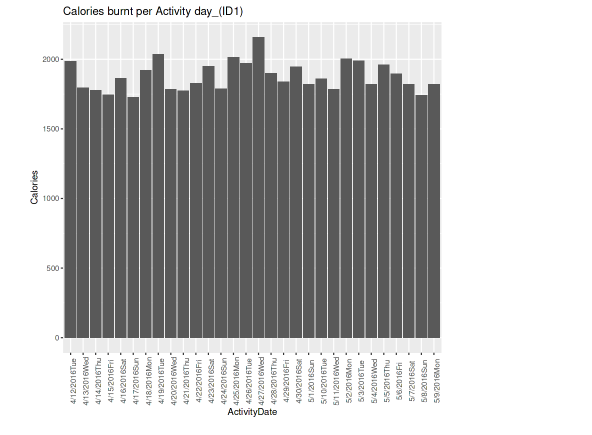
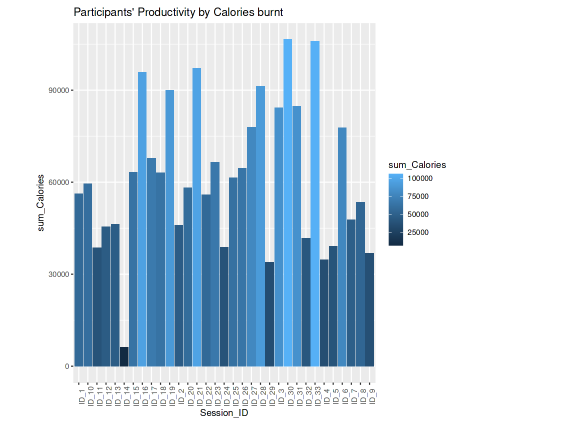
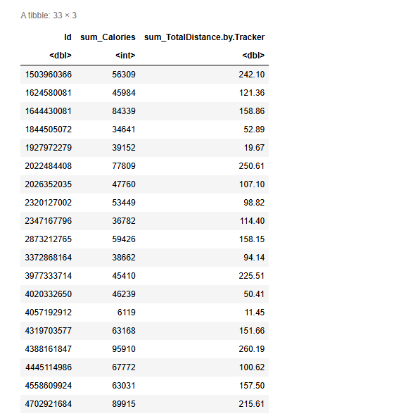
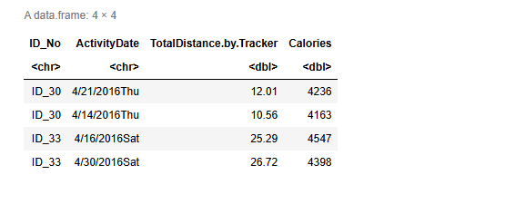

# Bellabeat Fitness-Track Case Study

### Exploring Smart Device Usage Patterns with R

## Introduction

The increasing use of smart devices has provided an opportunity to observe how people engage in daily fitness and wellness activities. Through recorded measures such as total steps, distance covered, and calories burned, users can monitor their activity progress and better understand their habits over time.

However, having access to these records is only one part of the process. The next concern is understanding what the activity records reveal, how the observed patterns differ among users, and how the resulting insights could help inform product development and marketing decisions.

This project explores these concerns through an R-based analysis of Fitbit fitness-tracker data, using **Bellabeat Time** as the case-study product.

My focus was to examine participants' activity sessions, observe the relationship between tracked distance and calories burned, and consider how the resulting activity patterns could inform Bellabeat's approach to customer engagement.

### Explore the Project

**[View the Complete Analysis and Visualizations](https://blessingoadeoye.github.io/Bellabeat_Case_Study/report_file.html)**

The published HTML report presents the original R analysis, including its saved code, tables, and visualizations.

**[View the Original R Notebook](analysis_file.ipynb)**

The notebook is retained as the original analytical record. Since GitHub may not render it directly, the HTML report is the recommended viewing option.

---

## Background: Bellabeat and Its Products

Bellabeat is a health-focused technology company that develops smart products designed to help women understand their health and daily wellness habits.

Its product offerings include:

- **Bellabeat App:** Provides users with health information related to activity, sleep, stress, menstrual cycles, and mindfulness.
- **Leaf:** A wellness tracker designed to monitor activities, sleep, and stress.
- **Time:** A wellness watch that tracks activity, sleep, and stress while connecting to the Bellabeat app.
- **Spring:** A smart water bottle that helps users monitor their hydration levels.

For this case study, I focused on **Bellabeat Time**, considering how fitness-tracking records and activity periods could contribute to understanding product usage and informing customer recommendations.

## Business Task — Ask

The primary objective was to examine trends in smart-device usage and consider how these observations could influence Bellabeat's marketing strategy.

More specifically, I sought to establish:

1. How participants' recorded activity sessions varied across activity dates.
2. How the distance covered during activity sessions related to the number of calories burned.
3. Whether particular participants or activity periods showed noticeable differences in recorded activity.
4. How these observations could inform recommendations for Bellabeat Time and its users.

The intention was not simply to identify the most active participant or activity day, but to consider what the recorded activities might suggest about fitness-tracking habits and the usefulness of activity monitoring.

---

## Data Source and Preparation — Prepare

### Dataset

I used the **[Fitbit Fitness Tracker Data](https://www.kaggle.com/datasets/arashnic/fitbit)**, a publicly available dataset hosted on Kaggle.

The dataset contains fitness-tracking records collected from Fitbit users in 2016, including measures associated with physical activity and daily fitness habits.

The original analysis worked with two CSV files:

| Dataset | Purpose |
|---|---|
| `DailyActivityMerged.csv` | Provided daily activity records for initial inspection and preparation |
| `FormattedActivityDate.csv` | Provided the formatted activity records used for date-based and participant-level comparisons |

The selected measures included participant IDs, activity dates, total steps, tracked distance, and calories burned.

These variables were relevant to the business task because they provided a basis for examining recorded activity sessions and comparing activity patterns across participants.

### Data Integrity and Limitations

Before proceeding with the analysis, I considered the nature and limitations of the available data.

**First, the data was collected from Fitbit users rather than Bellabeat customers.** As a result, the observations can inform exploratory recommendations, but they do not establish how Bellabeat customers currently use their devices.

**Second, the activity records were collected in 2016.** The dataset therefore provides a historical view of fitness-tracking behavior and cannot independently establish present-day usage patterns.

**Third, the records cover a limited group of participants and activity dates.** Any observed weekday pattern or difference between participants must be interpreted within that context.

These limitations are important when moving from recorded activity measures to recommendations about product usage and marketing.

---

## Tools I Used

The analysis was carried out using **R**, with the original workflow developed and saved in a Jupyter Notebook.

The packages used included:

- **tidyverse and dplyr:** For selecting variables, transforming data, grouping observations, and calculating summaries.
- **janitor:** For working with empty rows and columns during data preparation.
- **ggplot2:** For visualizing participants' recorded activity sessions and comparing calorie totals.
- **lubridate and berryFunctions:** Included in the original R environment setup.

The work primarily involved exploratory data analysis, data preparation, summary calculations, and visualization rather than predictive modeling.

---

## The Analytical Process

### 1. Inspecting and Processing the Activity Records — Process

I began by importing the activity datasets and examining their structures.

The initial checks included identifying duplicated observations and reviewing the unique records in the prepared activity dataset.

To focus on the measures relevant to the business task, I selected the participant ID, activity date, total steps, tracked distance, and calories burned.

```r
DailyActivitySummary <- DailyActivity %>%
  select(c(
    'Id',
    'ActivityDate',
    'TotalSteps',
    'TotalDistance.by.Tracker',
    'Calories'
  ))
```

This provided a narrower working dataset for examining the relationship between participants' recorded activities and the resulting calorie measures.

The original workflow also filtered out rows containing zero values across the selected columns and included checks for empty rows and columns.

```r
DailyActivitySummary1 <- DailyActivitySummary[
  !apply(DailyActivitySummary == 0, 1, any),
]
```

One consideration with this approach is that a zero value does not necessarily indicate an invalid record. It may also represent a genuine day with little or no recorded activity.

Consequently, this filtering step is best understood as part of the original exploratory preparation, rather than a universally appropriate cleaning rule.

### 2. Examining Individual Activity Sessions — Analyze

Having prepared the activity records, I proceeded to examine how participants' activity sessions developed across the recorded dates.

The original analysis separated the formatted activity data into 33 participant-specific datasets and used `ggplot2` to visualize calories burned over time.

For example, the following visualization was used for the first participant:

```r
ggplot(data = ID1) +
  geom_col(mapping = aes(
    x = ActivityDate,
    y = Calories
  )) +
  ggtitle("Calories burnt per Activity day_(ID1)") +
  theme(axis.text.x = element_text(angle = 90))
```

The purpose of these visualizations was to observe the differences in recorded calorie measures across activity sessions, rather than relying solely on an overall summary.

#### Individual Participant Activity Visualization



*Figure 1: Calories burned across recorded activity dates for participant ID1, as presented in the original R analysis.*

The notebook contains individual charts for all 33 participants, allowing their activity periods to be examined separately.

**An important technical consideration:** The original workflow separated participants using manually specified row ranges. This depends on the order of records in the prepared dataset and would need to be replaced with ID-based grouping in a more reproducible workflow.

Nevertheless, the saved visualizations document how the original analysis approached participant-level comparisons.

### 3. Comparing Activity Patterns Across Dates

One of the observations recorded in the original notebook was that **Thursday represented the highest recorded calorie activity day for 9 of the 33 participants**, equivalent to approximately 27% of the group.

This led to the consideration that activity levels may differ across weekdays.

However, this observation alone does not establish Thursday as the most productive day for fitness-tracker users generally.

The result is specific to the participants and activity records examined. A broader dataset and a more systematic comparison would be necessary before drawing conclusions about recurring weekday preferences.

The value of this stage was therefore in identifying a possible activity pattern for further investigation.

### 4. Calculating Overall and Average Calories

To examine activity records beyond the individual charts, I calculated the total calories recorded across activity dates.

```r
TotalCalories_Per_Day_Overall_IDs <-
  D.A.S_FormattedActivityDate %>%
  group_by(ActivityDate) %>%
  summarize(
    sum_Calories = sum(Calories)
  ) %>%
  arrange(desc(sum_Calories))
```

This calculation provided a summary of recorded calories by activity date, arranged from the highest total to the lowest.

I also calculated the mean calories for each activity date:

```r
MeanCalories_Overall_IDs <-
  D.A.S_FormattedActivityDate %>%
  group_by(ActivityDate) %>%
  summarize(
    mean_Calories = mean(Calories)
  ) %>%
  arrange(desc(mean_Calories))
```

These two summaries serve different purposes.

The **total** indicates the combined recorded calories for a given activity date, while the **mean** describes the average calorie measure across the records available for that date.

This distinction is important because a higher total may partly reflect a greater number of recorded observations, rather than higher activity per participant.

### 5. Comparing Participants' Recorded Activity

I further examined the participants by summarizing their recorded calories and tracked distances.

```r
TotalCalories_Per_ID <-
  D.A.S_FormattedActivityDate %>%
  group_by(Id) %>%
  summarize(
    sum_Calories = sum(Calories),
    sum_TotalDistance.by.Tracker =
      sum(TotalDistance.by.Tracker)
  )
```

The resulting summary was used to compare participant-level totals and produce a visualization of recorded calories.

#### Participant-Level Calorie Comparison



*Figure 2: Comparison of recorded calorie totals across participants. These are cumulative measures and may reflect differences in the number of recorded activity days.*

In the original analysis, **participants ID30 and ID33** stood out for their accumulated calorie totals. I subsequently examined their individual records to compare the activity dates, tracked distances, and calorie measures.

#### Participant Summary: Calories and Tracked Distance



*Figure 3: Participant-level summary of recorded calorie totals and tracked distances, produced during the original R analysis.*

The summary provided a basis for considering differences in participants' recorded activity sessions.

However, cumulative calorie totals should not be interpreted as a direct measure of productivity without accounting for the number of days recorded for each participant.

### 6. Considering the Relationship Between Distance and Calories

The final comparison examined the relationship between tracked distance and calories burned in selected participant records.

The original analysis observed that sessions involving greater recorded distances could also show higher calorie measures.

To examine this more closely, I selected records from participants ID30 and ID33 for comparison.

#### Selected Activity Records: ID30 and ID33



*Figure 4: Selected records for participants ID30 and ID33, showing activity dates, tracked distances, and calories burned.*

This comparison was useful because it allowed the recorded distance and calorie measures to be considered together, rather than treating participant totals as the only indicator of activity.

However, the analysis did not perform a formal statistical correlation test or establish a causal relationship between the two variables.

Other factors, including the nature of the activity and differences between participants, may influence calorie measures.

For this reason, the finding is presented as an **exploratory observation**, rather than proof that increasing distance necessarily causes a proportional increase in calories burned.

---

## Findings and Business Implications — Share

The analysis provided several observations that could inform further consideration of Bellabeat Time and its activity-tracking features.

| Observation | Interpretation | Possible implication for Bellabeat |
|---|---|---|
| Recorded activity measures differed across participants | Users may have different activity routines and levels of engagement | Activity monitoring could help users understand their individual progress |
| Some participants showed higher recorded calorie totals | Accumulated activity measures varied within the dataset | Progress summaries could help communicate changes in recorded activity |
| The original analysis identified Thursday as a notable activity day for some participants | Activity patterns may differ across days, although the finding is sample-specific | Day-based engagement patterns could be investigated using Bellabeat customer data |
| Tracked distance and calorie measures showed related changes in selected records | Activity measures may be useful when considered together | Combined activity summaries could help users interpret their fitness records |

These implications are exploratory. They are not evidence that a particular Bellabeat feature or marketing intervention would improve customer engagement without further testing.

### Recommendations

Based on the observations and the original case-study objective, I considered the following recommendations.

**1. Encourage regular activity through timely notifications.**

Bellabeat could explore reminders and motivational messages that encourage users to maintain their wellness routines.

Such messages may be more useful when informed by the user's recorded activity history rather than being delivered uniformly.

**2. Provide accessible activity-progress summaries.**

Presenting changes in steps, distance, and calories over time could help users understand their activity development and monitor their progress.

This would reinforce the value of recording activity sessions beyond simply collecting the underlying measurements.

**3. Explore personalized activity engagement.**

Since the records suggest that activity patterns can differ across participants and dates, Bellabeat could investigate whether personalized reminders or activity summaries would be useful to its customers.

Any proposed personalization should be evaluated using Bellabeat-specific usage data.

**4. Investigate additional wellness-tracking features.**

The case study also considered the potential value of helping users understand their physical responses during and after activity sessions.

This could provide a direction for further product research, although the available dataset does not establish demand for any specific additional feature.

---

## What I Learned

This project helped me appreciate how recorded fitness activities could be examined to develop observations relevant to a business task.

Working with the daily activity records provided an opportunity to practice data inspection, filtering, summary calculations, and visualization using R.

More importantly, the analysis demonstrated the need to distinguish between **what the data records and what those records can reasonably establish**.

For example, identifying a participant with a high total calorie measure does not necessarily mean that the participant was consistently more active than others. Similarly, observing higher calorie measures on a particular weekday does not establish that the same pattern would apply to a wider population.

Looking back at the original workflow, I can also identify areas where the analytical process could be improved, particularly in participant grouping, treatment of zero-value observations, and validation of the reported relationships.

These considerations are useful lessons from the project and provide a clearer basis for approaching similar analytical tasks in the future.

---

## Project Scope and Reproducibility

This repository preserves the original Bellabeat R case study and its saved analytical outputs.

The original CSV files used during the analysis are not currently available in the repository. Consequently, the results have not been independently reproduced or revalidated as part of this documentation update.

The HTML report is provided to make the original notebook accessible in a browser, including its R code, saved tables, and visualizations.

The analysis should therefore be understood as a documented exploratory case study, rather than a fully reproducible or statistically validated assessment of Bellabeat customer behavior.

## Conclusion

The Bellabeat Fitness-Track Case Study focused on understanding participants' recorded fitness activities and considering how smart-device usage patterns could inform product recommendations.

Using R, I examined daily activity records, compared participant-level calorie measures, summarized activity dates, and explored the relationship between tracked distance and calories burned.

The resulting observations highlighted possible differences in activity routines and the potential value of presenting users with meaningful summaries of their recorded progress.

While the dataset and original analytical methods place limitations on the conclusions that can be drawn, the project remains a useful demonstration of exploratory data analysis and the process of connecting technical observations to business considerations.

Ultimately, the case study reinforced an important lesson: **the value of an analysis depends not only on the patterns identified, but also on how carefully those patterns are interpreted and applied to the business task.**

---

## Repository Contents

| File or Folder | Description |
|---|---|
| [`analysis_file.ipynb`](analysis_file.ipynb) | Original R analysis notebook with saved outputs |
| [`report_file.html`](report_file.html) | Browser-readable HTML export of the notebook |
| [`media/`](media/) | Screenshots of selected visualizations and analytical outputs |
| [`README.md`](README.md) | Project background, workflow, findings, recommendations, and limitations |

**[Open the Full Bellabeat Analysis Report](https://blessingoadeoye.github.io/Bellabeat_Case_Study/report_file.html)**
